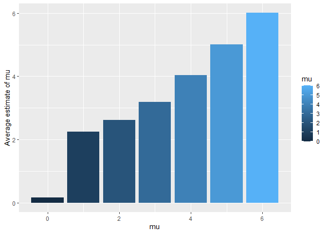

p8105_hw5_yb2584
================
Yunshen Bai
2023-11-15

``` r
library(tidyverse)
library(rvest)
library(dplyr)
library(tidyr)
```

## Problem 1

For this problem, we are interested in data gathered and made public by
*The Washington Post* on homicides in 50 large U.S. cities. The code
chunk below imports and cleans the data.

``` r
homicide_df = 
  read_csv("data/homicide-data.csv", na = c("", "NA", "Unknown")) %>%
  mutate(
    city_state = str_c(city, state, sep = ", "),
    resolution = case_when(
      disposition == "Closed without arrest" ~ "unsolved",
      disposition == "Open/No arrest"        ~ "unsolved",
      disposition == "Closed by arrest"      ~ "solved"
    )
  ) %>% 
  filter(city_state != "Tulsa, AL") 
```

    ## Rows: 52179 Columns: 12
    ## -- Column specification --------------------------------------------------------
    ## Delimiter: ","
    ## chr (8): uid, victim_last, victim_first, victim_race, victim_sex, city, stat...
    ## dbl (4): reported_date, victim_age, lat, lon
    ## 
    ## i Use `spec()` to retrieve the full column specification for this data.
    ## i Specify the column types or set `show_col_types = FALSE` to quiet this message.

The resulting dataframe has 52178 entries, on variables that include the
victim name, race, age, and sex; the date the homicide was reported; and
the location of the homicide. In cleaning, I created a `city_state`
variable that includes both city and state, and a `resolution` variable
to indicate whether the case was closed by arrest. I also excluded one
entry in Tulsa, AL, which is not a major US city and is most likely a
data entry error.

In the next code chunk, I group within cities and summarize to produce
the total number of homicides and the number that are solved.

``` r
city_homicide_df = 
  homicide_df %>% 
  select(city_state, disposition, resolution) %>% 
  group_by(city_state) %>% 
  summarize(
    hom_total = n(),
    hom_unsolved = sum(resolution == "unsolved"))
```

Focusing only on Baltimore, MD, I can use the `prop.test` and
`broom::tidy` functions to obtain an estimate and CI of the proportion
of unsolved homicides in that city. The table below shows those values.

``` r
bmore_test = 
  prop.test(
    x = filter(city_homicide_df, city_state == "Baltimore, MD") %>% pull(hom_unsolved),
    n = filter(city_homicide_df, city_state == "Baltimore, MD") %>% pull(hom_total)) 

broom::tidy(bmore_test) %>% 
  knitr::kable(digits = 3)
```

| estimate | statistic | p.value | parameter | conf.low | conf.high | method                                               | alternative |
|---------:|----------:|--------:|----------:|---------:|----------:|:-----------------------------------------------------|:------------|
|    0.646 |   239.011 |       0 |         1 |    0.628 |     0.663 | 1-sample proportions test with continuity correction | two.sided   |

Building on this code, I can use functions in the `purrr` package to
obtain estimates and CIs for the proportion of unsolved homicides in
each city in my dataset. The code below implements this analysis.

``` r
test_results = 
  city_homicide_df %>% 
  mutate(
    prop_tests = map2(hom_unsolved, hom_total, \(x, y) prop.test(x = x, n = y)),
    tidy_tests = map(prop_tests, broom::tidy)) %>% 
  select(-prop_tests) %>% 
  unnest(tidy_tests) %>% 
  select(city_state, estimate, conf.low, conf.high) %>% 
  mutate(city_state = fct_reorder(city_state, estimate))
```

Finally, I make a plot showing the estimate (and CI) of the proportion
of unsolved homicides in each city.

``` r
test_results %>% 
  mutate(city_state = fct_reorder(city_state, estimate)) %>% 
  ggplot(aes(x = city_state, y = estimate)) + 
  geom_point() + 
  geom_errorbar(aes(ymin = conf.low, ymax = conf.high)) + 
  theme(axis.text.x = element_text(angle = 90, hjust = 1))
```

<!-- -->

This figure suggests a very wide range in the rate at which homicides
are solved – Chicago is noticeably high and, given the narrowness of the
CI, likely is the location of many homicides.

## Problem 2

``` r
files_name=list.files("./data/data")
setwd("C:/Users/Leon/Desktop/p8105_hw5_yb2584/data/data")
output=map(files_name,read_csv)
```

Create a tidy dataframe containing data from all participants, including
the subject ID, arm, and observations over time.

``` r
dt=
  do.call(rbind.data.frame, output)|>
  mutate(arm_id=str_remove(files_name,".csv"))|>
  mutate(arm=strsplit(arm_id,"_")[[1]][1],id=strsplit(arm_id,"_")[[1]][2])|>
  select(arm_id,arm,id,everything())
```

Make a spaghetti plot showing observations on each subject over time,
and comment on differences between groups.

``` r
dt|>
  pivot_longer(
    week_1:week_8,
    names_to = "week",
    values_to = "value"
  )|>
  mutate(num=rep(1:8,20))|>
ggplot(aes(x=num,y=value,color=arm_id))+
  geom_point()+
  geom_line()+
  scale_x_continuous(
    breaks = 1:8, 
    labels = c("Week 1","Week 2","Week 3","Week4","Week 5","Week 6","Week 7","Week 8"))+
  labs(
    x="Week",
    y="Value",
    color="Arm and ID"
  )+
  theme(legend.position = "bottom")+ 
  viridis::scale_color_viridis(
    name = "Location", 
    discrete = TRUE
  )
```

<!-- -->

From above plot, we can know that generally the value for experimental
arm is higher than control arm, and this trend will become more obvious
over time.

## Problem 3

In this problem, we will conduct a simulation to explore power in a
one-sample t-test. We fix $n=30$ and $\sigma=5$, generate 5000 dataset
from the model $x \sim Normal(\mu,\sigma)$. For each dataset, save
$\hat{\mu}$ and the p-value arising from a hypothesis test using
$\alpha=0.05$

``` r
est_mu=rep(0,5000)
p_val=rep(0,5000)
for(i in 1:5000)
{
  sam=rnorm(30,0,5)
  res=t.test(sam,mu=0)
  est_mu[i]=mean(sam)
  p_val[i]=broom::tidy(res)$p.value
}
mu_0=data.frame(est_mu,p_val)
```

``` r
est_mu=rep(0,5000)
p_val=rep(0,5000)
for(i in 1:5000)
{
  sam=rnorm(30,1,5)
  res=t.test(sam,mu=0)
  est_mu[i]=mean(sam)
  p_val[i]=broom::tidy(res)$p.value
}
mu_1=data.frame(est_mu,p_val)
```

``` r
est_mu=rep(0,5000)
p_val=rep(0,5000)
for(i in 1:5000)
{
  sam=rnorm(30,2,5)
  res=t.test(sam,mu=0)
  est_mu[i]=mean(sam)
  p_val[i]=broom::tidy(res)$p.value
}
mu_2=data.frame(est_mu,p_val)
```

``` r
est_mu=rep(0,5000)
p_val=rep(0,5000)
for(i in 1:5000)
{
  sam=rnorm(30,3,5)
  res=t.test(sam,mu=0)
  est_mu[i]=mean(sam)
  p_val[i]=broom::tidy(res)$p.value
}
mu_3=data.frame(est_mu,p_val)
```

``` r
est_mu=rep(0,5000)
p_val=rep(0,5000)
for(i in 1:5000)
{
  sam=rnorm(30,4,5)
  res=t.test(sam,mu=0)
  est_mu[i]=mean(sam)
  p_val[i]=broom::tidy(res)$p.value
}
mu_4=data.frame(est_mu,p_val)
```

``` r
est_mu=rep(0,5000)
p_val=rep(0,5000)
for(i in 1:5000)
{
  sam=rnorm(30,5,5)
  res=t.test(sam,mu=0)
  est_mu[i]=mean(sam)
  p_val[i]=broom::tidy(res)$p.value
}
mu_5=data.frame(est_mu,p_val)
```

``` r
est_mu=rep(0,5000)
p_val=rep(0,5000)
for(i in 1:5000)
{
  sam=rnorm(30,6,5)
  res=t.test(sam,mu=0)
  est_mu[i]=mean(sam)
  p_val[i]=broom::tidy(res)$p.value
}
mu_6=data.frame(est_mu,p_val)
```

Make a plot showing the proportion of times the null was rejected (the
power of the test) on the y axis and the true value of $\mu$ on the x
axis.

``` r
data.frame(mu=0:6,prop=c(sum(mu_0$p_val<0.05)/5000,
                         sum(mu_1$p_val<0.05)/5000,
                         sum(mu_2$p_val<0.05)/5000,
                         sum(mu_3$p_val<0.05)/5000,
                         sum(mu_4$p_val<0.05)/5000,
                         sum(mu_5$p_val<0.05)/5000,
                         sum(mu_6$p_val<0.05)/5000))|>
  ggplot(aes(x=mu,y=prop,fill=mu))+
  geom_bar(stat="identity")+
  labs(
    x="mu",
    y="Proportion",
    color="mu"
  )
```

<!-- -->

From the above plot, we the effect size get higher, the power of the t
test get higher.

Make a plot showing the average estimate of $\hat{\mu}$ on the y axis
and the true value of $\mu$ on the x axis.

``` r
data.frame(mu=0:6,est_mu=c(mean(mu_0$est_mu),
                         mean(mu_1$est_mu),
                         mean(mu_2$est_mu),
                         mean(mu_3$est_mu),
                         mean(mu_4$est_mu),
                         mean(mu_5$est_mu),
                         mean(mu_6$est_mu)))|>
  ggplot(aes(x=mu,y=est_mu,fill=mu))+
  geom_bar(stat="identity")+
  labs(
    x="mu",
    y="Average estimate of mu",
    color="mu"
  )
```

<!-- -->

Make a second plot the average estimate of $\hat{\mu}$ only in samples
for which the null was rejected on the y axis and the true value of
$\mu$ on the x axis.

``` r
data.frame(mu=0:6,est_mu=c(mean(mu_0$est_mu[mu_0$p_val<0.05]),
                         mean(mu_1$est_mu[mu_1$p_val<0.05]),
                         mean(mu_2$est_mu[mu_2$p_val<0.05]),
                         mean(mu_3$est_mu[mu_3$p_val<0.05]),
                         mean(mu_4$est_mu[mu_4$p_val<0.05]),
                         mean(mu_5$est_mu[mu_5$p_val<0.05]),
                         mean(mu_6$est_mu[mu_6$p_val<0.05])))|>
  ggplot(aes(x=mu,y=est_mu,fill=mu))+
  geom_bar(stat="identity")+
  labs(
    x="mu",
    y="Average estimate of mu",
    color="mu"
  )
```

<!-- -->

From above two plots, the sample average of $\hat{\mu}$ across tests for
which the null is rejected is approximately equal to the true value of
$\mu$. Since the $\hat{\mu}$ across tests for which the null is rejected
could be significantly smaller or larger than the true value of $\mu$,
the sample average of $\hat{\mu}$ across tests for which the null is
rejected will be not far from the true value of $\mu$.
